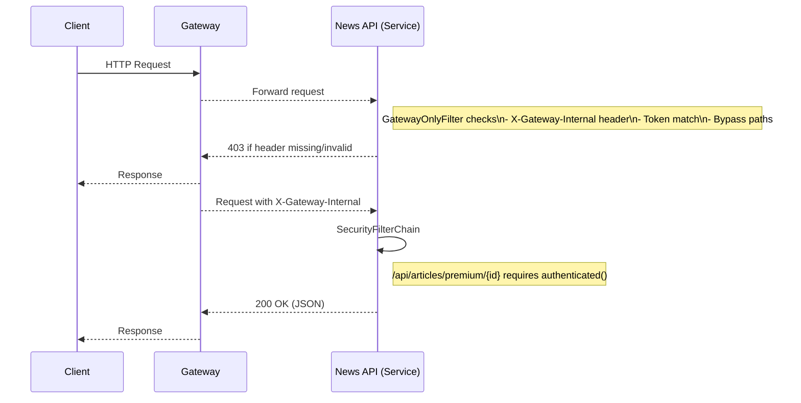
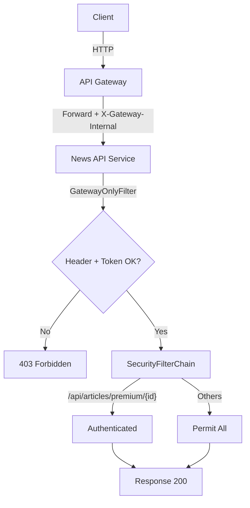

# 백엔드 서비스 게이트웨이 전용 접근 구현하기

목표: “유/무료 뉴스 API 엔드포인트와 인증 정책, 게이트웨이 전용 접근”을 따라하며 실습

---

## 1. 전체 개요

이 서비스는 “API Gateway를 통해서만 접근”하도록 설계되었습니다. 서비스 인스턴스에 직접 호출이 들어오면 차단합니다. 또한, 유료 기사 상세보기는 인증(또는 게이트웨이에서 부여한 신뢰)이 필요합니다.

핵심 구성 요소:
- `config/GatewayOnlyFilter.java`: 게이트웨이 전용 접근 검사
- `config/SecurityConfig.java`: 엔드포인트별 접근 정책
- `config/SecurityProperties.java`: application.properties로 게이트웨이 모드/토큰 관리
- `config/WebConfig.java`, `config/CategoryConverter.java`: 카테고리 URL → Enum 자동 매핑
- `controller/NewsArticleController.java`: 뉴스 API (무료/유료/카테고리/상세/CRUD)

---

## 2. 변경 요약 (해당 커밋 이후 주요 추가사항)

- 컨트롤러 엔드포인트 정리 및 페이지네이션 추가
  - GET `/api/articles` (page,size)
  - GET `/api/articles/free` (page,size)
  - GET `/api/articles/premium` (page,size)
  - GET `/api/articles/category/{category}` (page,size) — `civic-engagement` 등 하이픈 카테고리 지원
  - GET `/api/articles/{id}` (숫자만), GET `/api/articles/free/{id}`, GET `/api/articles/premium/{id}`
  - POST/PUT/DELETE `/api/articles` CRUD
- 카테고리 URL 매핑 자동화
  - `CategoryConverter` + `WebConfig`로 하이픈 문자열을 Enum으로 자동 변환
- 게이트웨이 전용 접근 도입
  - `GatewayOnlyFilter`: `X-Gateway-Internal` 헤더 + 토큰 검증, 헬스체크 등 일부 우회 경로 허용
  - `SecurityConfig`: 유료 상세보기 `/api/articles/premium/{id}`만 인증 필요, 나머지 permitAll
- 실사용 가능한 이미지 URL 적용 (picsum.photos)

---

## 3. 동작 흐름 한눈에 보기





---

## 4. 실습: 게이트웨이 전용 접근 따라하기

### 4-1. 필수 설정
`application.properties` 또는 환경변수로 게이트웨이 모드와 토큰을 설정합니다.

```properties
# 게이트웨이 전용 모드 ON
app.security.gateway-only=true
# 게이트웨이가 서비스로 전달 시 넣어주는 내부 토큰 (예: k8s/ingress나 API Gateway에서 추가)
app.security.gateway-token=CHANGE_ME_SECRET

# CORS: 게이트웨이(or 프론트) 주소만 허용
# SecurityConfig 기본값: http://localhost:8000
```

실행:
```bash
./gradlew bootRun
```

### 4-2. 직접 접근 차단 확인 (실패)
게이트웨이 헤더 없이 호출하면 403이 나와야 합니다.

```bash
curl -i http://localhost:8080/api/articles
# HTTP/1.1 403 Forbidden
# {"error":"Forbidden","message":"Direct access not allowed. Please use the API Gateway.", ...}
```

### 4-3. 게이트웨이 역할로 접근 (성공)
게이트웨이가 붙이는 전용 헤더를 흉내 내어 호출합니다.

```bash
curl -i http://localhost:8080/api/articles \
  -H "X-Gateway-Internal: CHANGE_ME_SECRET"
# 200 OK + 기사 리스트
```

### 4-4. 유료 기사 상세 보기의 인증 정책
`SecurityConfig`에는 유료 상세보기만 인증이 필요합니다.

```java
.authorizeHttpRequests(auth -> auth
    .requestMatchers("/api/articles/premium/{id:[0-9]+}").authenticated()
    .requestMatchers("/api/articles/premium").permitAll()
    .anyRequest().permitAll()
);
```

- 리스트(`/api/articles/premium`)는 공개
- 상세(`/api/articles/premium/{id}`)는 인증(게이트웨이 또는 추가 보안) 필요

호출 테스트:
```bash
# (실패) 헤더 없이
curl -i http://localhost:8080/api/articles/premium/1
# 403 Forbidden (GatewayOnlyFilter)

# (성공) 게이트웨이 헤더 포함
curl -i http://localhost:8080/api/articles/premium/1 \
  -H "X-Gateway-Internal: CHANGE_ME_SECRET"
# 200 OK + 해당 유료 기사
```

---

## 5. 카테고리 URL 자동 매핑 호출 테스트
하이픈 문자열을 Enum으로 자동 변환합니다. 예: `civic-engagement` → `CIVIC_ENGAGEMENT`

```bash
# 게이트웨이 헤더 포함해야 통과
curl -s "http://localhost:8080/api/articles/category/civic-engagement?page=0&size=10" \
  -H "X-Gateway-Internal: CHANGE_ME_SECRET"
```

구성 요소:
- `CategoryConverter`: String → Category 변환기
- `WebConfig`: 컨버터 등록(`addFormatters`)
- `Category.fromValue(String)`: 보조 변환 메서드

---

## 6. 컨트롤러 엔드포인트 요약

리스트 (페이지네이션 옵션 `?page=0&size=25`):
- GET `/api/articles`
- GET `/api/articles/free`
- GET `/api/articles/premium`
- GET `/api/articles/category/{category}`

개별 상세 조회:
- GET `/api/articles/{id}` (전체)
- GET `/api/articles/free/{id}` (무료)
- GET `/api/articles/premium/{id}` (유료, 인증 필요)

CRUD:
- POST `/api/articles`
- PUT `/api/articles/{id}`
- DELETE `/api/articles/{id}`

헬스체크:
- GET `/api/articles/health` (게이트웨이 필터 우회 경로)

---

## 7. 학습 완료 체크리스트

- [ ] 게이트웨이 전용 모드/토큰을 설정했다
- [ ] 게이트웨이 헤더 없이 403이 발생함을 확인했다
- [ ] 게이트웨이 헤더로 200 OK를 확인했다
- [ ] 카테고리 하이픈 URL이 정상 동작함을 확인했다
- [ ] 유료 상세보기는 인증이 필요함을 확인했다

---

## 8. 확장하기
- 게이트웨이에서 `X-Gateway-Internal` 헤더를 어떻게 추가할지, 실제 Nginx/Ingress/AWS API Gateway 예시 조사
- SecurityConfig에서 `/api/articles/premium` 리스트에도 인증을 걸어보기
- GatewayOnlyFilter에 허용 IP 범위(사설망 대역) 확대 옵션 실험
- 실제 프론트엔드 주소를 CORS 허용 목록에 반영해보기